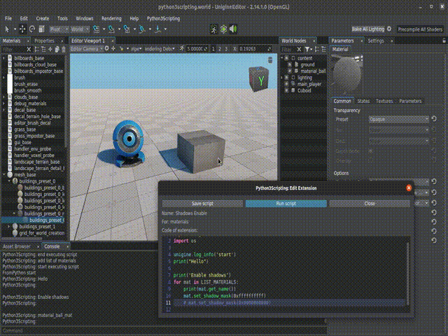
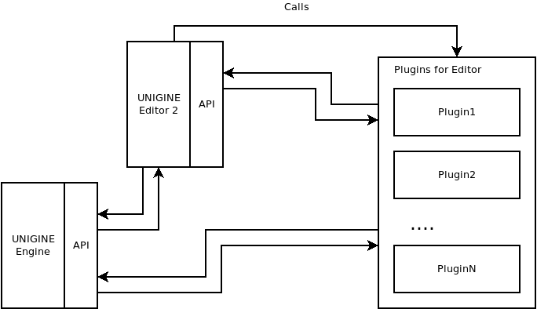

# unigine-editor-python3scripting

**IN-PROGRESS...**

[](https://developer.unigine.com/en/docs/2.17/)

Pluging for scripting by python3 in Unigine Editor https://unigine.com/get-unigine/

* License of plugin: MIT
* For code editor used: https://github.com/Megaxela/QCodeEditor - under MIT license
* Build-in Python-3.10.1 https://github.com/python/cpython/tree/v3.10.1 - under Python Software Foundation license
* Unigine SDK 2.17 - tested on `Community Free`



## Prebuilded versions here

[here](https://sea-kg.com/files/unigine-plugins/UnigineEditorPlugin_Python3Scripting/v2.17/)

## Plugins system of Unigine Editor




## build

### build python

on windows:
```
> cd source/plugins/Sea5Kg/Python3Scripting/
> build_python.bat
```

on linux:
```
$ cd source/plugins/Sea5Kg/Python3Scripting/
$ build_python.bat
```

### build pugin

Required:
1. cmake 3.19+
2. Python 3+
3. on windows: Visual Studio 17 2022


Build on linux

Python:
```sh
$ docker run --rm -it -v `pwd`:/opt/sources sea5kg/unigine-editor-pluigns:v2.17 bash -c "cd source/plugins/Sea5kg/Python3Scripting && ./build_python.sh"
```

Plugin:
```sh
$ docker run --rm -it -v `pwd`:/opt/sources sea5kg/unigine-editor-pluigns:v2.17 ./build_plugin.py
```


## Useful

### Mp4 to gif

https://ezgif.com/video-to-gif/

or

```
ffmpeg -ss 4 -t 50 -i create_node.mp4 -vf "fps=5,scale=1600:-1:flags=lanczos,split[s0][s1];[s0]palettegen[p];[s1][p]paletteuse" -loop 0 create_node.gif
```


